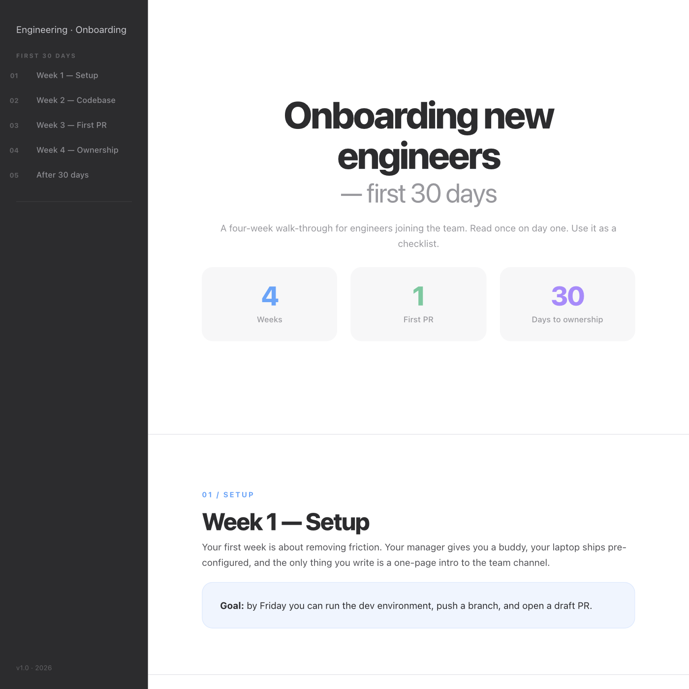
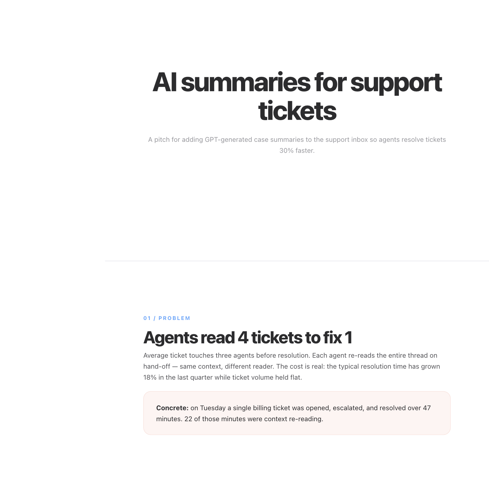

# deshtml

> One command turns an idea into a beautifully designed, self-contained HTML document.



*Above: a handbook generated by `/deshtml` from five interview answers. The full HTML lives at [`docs/examples/handbook-onboarding.html`](docs/examples/handbook-onboarding.html) — open it in a browser.*

## Why this exists

Most teams ship designed documents only when a designer is in the loop — pitches, handbooks, meeting briefings, system overviews. Everything else lives in plaintext markdown that nobody re-reads. The cost is real: a designed handbook gets read end-to-end. A markdown spec gets skimmed once and forgotten.

`deshtml` removes the designer from the loop. You answer six short questions, approve a story arc, and Claude writes a single HTML file with the same palette, typography, and component library as a hand-designed document. No design knowledge required, no design tools opened, no template editing.

## How a run works

`/deshtml` is a [Claude Code](https://claude.com/claude-code) skill. Once installed, it adds a `/deshtml` command to your Claude session. Type it, and:

1. **Pick a doc type** — `handbook`, `pitch`, `technical brief`, `presentation`, or `meeting prep`. The picker uses Claude Code's interactive `AskUserQuestion` UI — pick from options, no typing required.
2. **Answer five short questions** — audience, material, sections, tone, and any must-haves. Most questions offer multi-choice presets with sensible defaults; only open content (audience prose, material, takeaway) needs free text.
3. **Review the story arc** — Claude proposes a five-column table (`#`, `Beat`, `Section`, `One sentence`, `Reader feels`) plus a flowing paragraph that joins every `One sentence` top-to-bottom. If the paragraph reads as one coherent story, the structure is right. If it reads choppy, the arc needs work.
4. **Type `approve`** — Claude writes a `YYYY-MM-DD-<slug>-<type>.html` file to your current directory and opens it in your browser. The absolute path is the last line of output.

Generation is one-shot. To revise, edit through normal conversation with Claude on the file — there is no in-skill revision loop.

## Three modes

`/deshtml` picks one of three modes automatically at turn 1:

- **Interview mode** (default) — runs the five questions described above.
- **Context mode** — when the prior conversation already discussed the document being created (audience, content, structure, tone), the skill drafts the answers from context and asks you to confirm with one prompt. Edit specific fields or accept the whole draft. Triggers when 2+ context signals are present; otherwise falls back to interview mode.
- **Source mode** — `/deshtml @path/to/draft.md` (or paste >200 characters of prose) skips the interview entirely. The skill reads the source, infers the doc type from its shape, and grounds every story-arc beat in source content. Same arc gate.

## What "story-first" means

Every document `deshtml` generates is built around an explicit narrative arc, not a list of headings. Before any HTML is written, Claude proposes:

- A **table** with five columns: section number, narrative beat, section title, one-sentence summary, reader's emotional state.
- A **flowing paragraph** that joins all the one-sentence summaries top-to-bottom and presents them as one read.

The paragraph is the diagnostic. If it reads as a story (each sentence sets up the next), the document will read as a story. If it reads as disconnected bullets, the arc is wrong — and you can see it before any content is written. The skill refuses to render HTML until you explicitly type `approve` (or one of nine equivalent phrases). This gate is mechanical, not fuzzy: anything else is treated as a revision request.

## The five doc types

| Type | When to use it | Format |
| --- | --- | --- |
| **Handbook** | Multi-section reference doc — onboarding, runbook, system overview | Sidebar layout, 960px wide |
| **Pitch** | Problem → solution → ask narrative | Linear, 1440px wide |
| **Technical brief** | Architecture or decision write-up for engineers | Sidebar layout |
| **Presentation** | Single-page slide deck with anchor navigation, click-to-advance, and keyboard nav | Full-viewport slides, scroll-snap |
| **Meeting prep** | Briefing with context, talking points, anticipated questions | Linear |

The skill picks the format from the doc type and the section count automatically — you do not pick it.

### Examples

| | |
| --- | --- |
|  |  |
| **Pitch** — `pitch-ai-support.html` | **Presentation** — `presentation-q3-roadmap.html` |

Open the live HTML files under [`docs/examples/`](docs/examples/) to see them in a browser. Every example was generated by the skill itself; no hand editing.

## Install

Paste this in a terminal:

```bash
curl -fsSL https://raw.githubusercontent.com/sperezasis/deshtml/main/bin/install.sh | bash
```

The skill installs to `~/.claude/skills/deshtml/`. Re-running the same command updates an existing install in place.

## Presentation interactivity

Generated presentation decks ship with built-in navigation:

- **Side arrows** (‹ ›) at the left and right edges of the viewport. The left arrow hides on slide 1, the right arrow hides on the last slide.
- **Click anywhere on a slide** to advance. Cards, links, and buttons inside the slide content are excluded so they keep their own behavior.
- **Keyboard navigation**: `→ ↓ Space PageDown` advance; `← ↑ PageUp` go back.
- **Active slide highlight** in the top-right slide-nav numbers — the current slide's number is colored in.

Presentations are the only format where the audit allows a `<script>` block (the official navigation script ships verbatim with the skeleton). Handbooks, pitches, technical briefs, and meeting prep stay pure HTML+CSS.

## Auto-update notice

When a newer version of deshtml is available on `main`, `/deshtml` surfaces a one-line notice as the first line of its output. Cached for 6h. Silent when up to date or offline. Re-run the install one-liner to update.

## Uninstall

```bash
curl -fsSL https://raw.githubusercontent.com/sperezasis/deshtml/main/bin/uninstall.sh | bash
```

Or remove the directory directly:

```bash
rm -rf ~/.claude/skills/deshtml
```

## Known limitations

- **Offline:** the generated HTML loads the Inter font from Google Fonts. Without internet, the document falls back to your system font and still renders correctly.
- **macOS-first:** after writing the file, the skill runs `open <file>` to launch your default browser. `open` is macOS-only; on Linux the file is written and the absolute path is printed, but the browser does not auto-open.
- **One file per run:** the skill writes one HTML file and stops. To revise, ask Claude to edit the file in normal conversation.

## Design system

The palette, typography, and component library are based on the **Caseproof Documentation System**, an internal Caseproof design system. Public access is not yet available.

## License

MIT. See [LICENSE](LICENSE).
